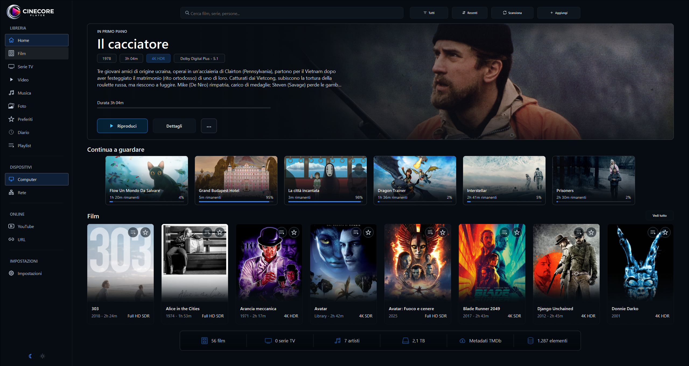
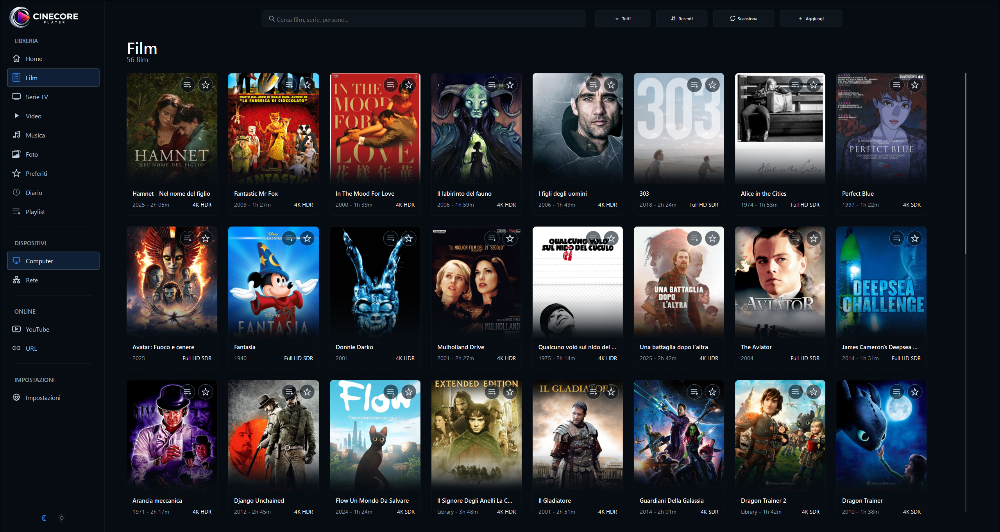
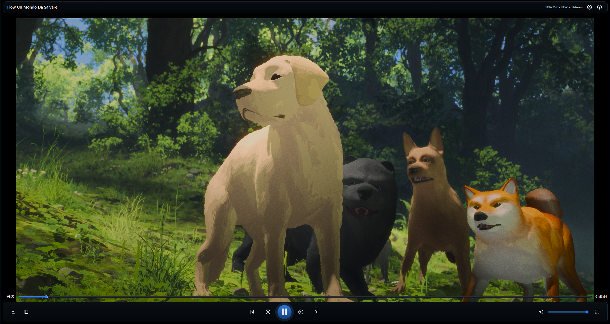
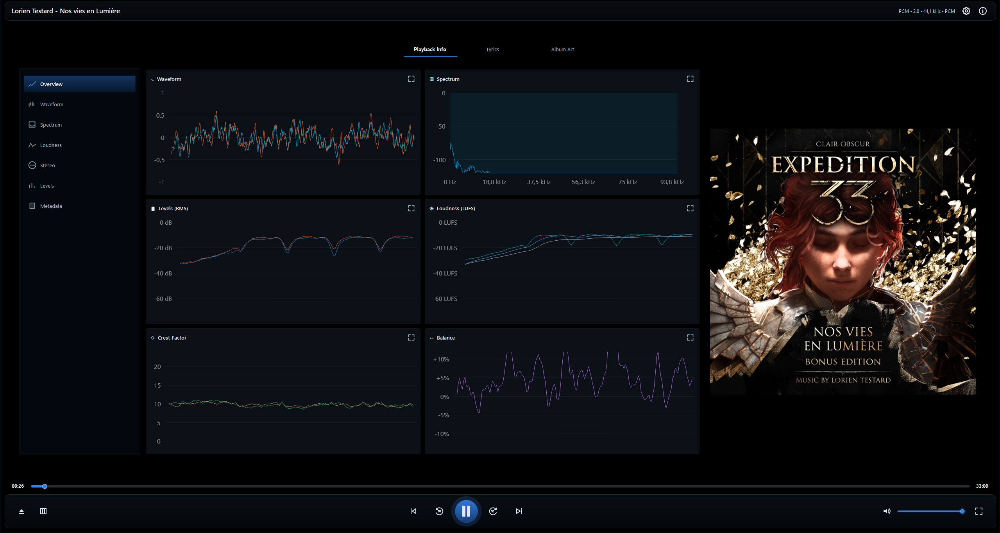
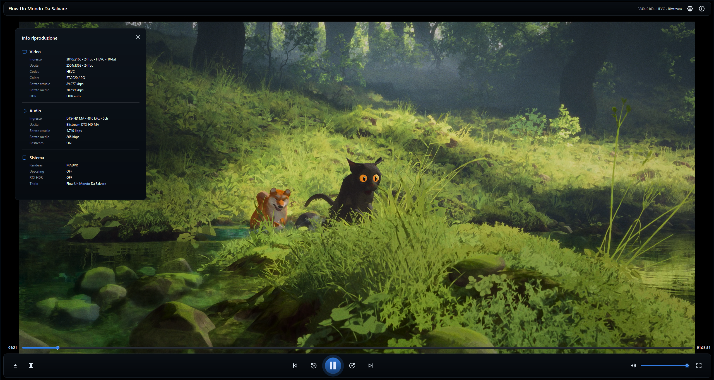
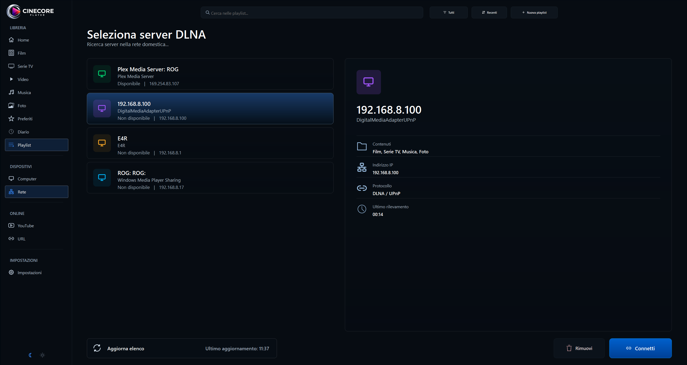
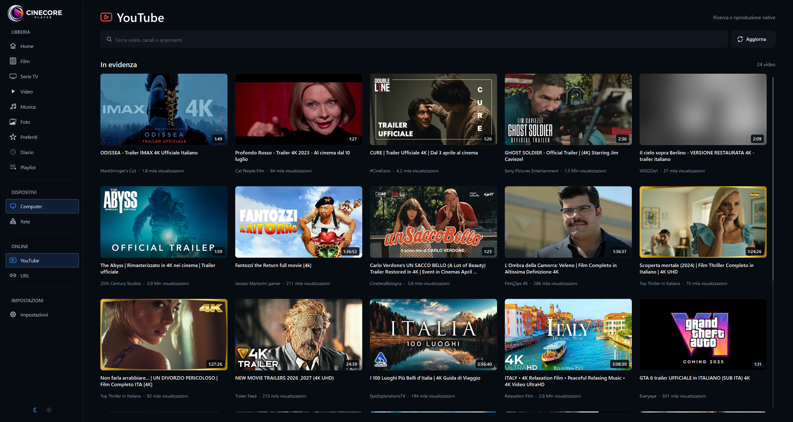

# 🎬 Cinecore Player 2025

Cinecore Player is a **free**, **source-available**, **non-commercial** media player for Windows, built in **C# / .NET 9.0** and focused on high-quality playback with **madVR**.

Designed as a modern DirectShow-based player, Cinecore combines advanced video rendering, intelligent **HDR management**, and support for multiple renderer backends, including **madVR**, **MPC Video Renderer (MPCVR)**, **EVR** and **libmpv**.

Beyond playback, Cinecore includes a growing set of media-center features such as a **TMDB-integrated library**, an **online remote controller**, **Cinema Mode**, resume playback, playlist/favorites support, and many other interface and usability improvements.

The player is also built with **audiophiles** in mind, featuring a dedicated **Audio Mode** with real-time visualizations such as oscilloscope and spectrum analyzer. Audio output supports both **bitstream** and **PCM**, with compatibility for **exclusive** and **non-exclusive** output modes.

V2 will be out soon, it need just a little more of time in order to correct bugs!

> **Development status:** Cinecore Player is currently in active development.  
> A public alpha has been published.

---

## 📸 Screenshots

## NEW HUD (NOT AVAILABLE YET)

## Home

## Library

## Film Details

## Video Player

## Audio Graphs

## Info Overlay

## DLNA

## YOUTUBE

---

## 📌 Project status (truthful current)

Cinecore Player is currently in **alpha**.  
The core playback experience is already usable, and several advanced features are implemented, but some modules are still incomplete, experimental, or not yet fully polished.

---

## 🖥️ System requirements (end users)

- **Operating system:** Windows
- **Runtime:** .NET 9.0
- **Renderer support:** madVR / EVR / MPCVR and libmpv

---

## ✅ Working features

- **Video playback via madVR, mpcvr, EVR and libmpv**  
  Core playback is stable on these renderers.

- **Audio playback (PCM & Bitstream)**  
  Standard playback works reliably across supported formats.

- **TMDB-integrated library**  
  The media library includes TMDB integration.

- **Online Remote Control**  
  Remote control functionality is implemented and usable during playback.

- **Cinema Mode**  
  Includes a pre-playback movie placeholder screen, demo playback for **Dolby Atmos / DTS:X MA / THX**, **WLED** integration   for turning off room lighting, and then movie playback.

- **Resume playback**  
  Content can be resumed from the point where playback was previously stopped.

- **Audio graphs**
  Functional.

- **Lyrics**  
  Generally functional.

- **Photo viewer**  
  Fully operational.

- **HUD / On-Screen Display**  
  Generally functional, though still in need of refinement.

- **SKIP Intro/Outro (next episode) for TV Series**  
  Functional.

- **DLNA**  
  Generally functional.

---

## ⚠️ Known issues

- **HUD visual glitches**  
  The HUD works, but occasional graphical artifacts may still occur.

_ **VARIOUS BUGS**
  There're still some problems that need to be fixed
  
---

## 🛠️ In development

- **PCM audio tweaks**
- **Realtime HDR analyzer**
- **HUD personalization options**
- **360 rendering**
- **YouTube integration**
- **Expanded renderer settings**
- **Additional HUD refinements**
- **New features**
- **General QoL enhancements across the UI**

Many other additions are currently in development.

## EVERY SUGGESTION IS APPRECIATED

---
