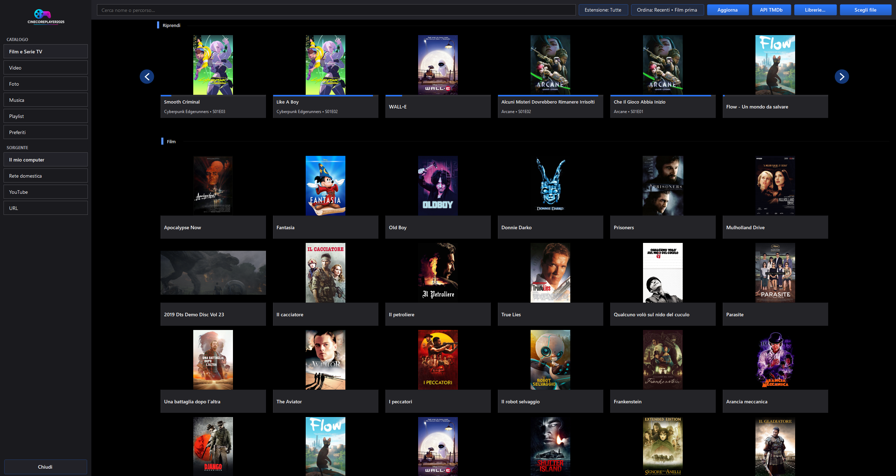
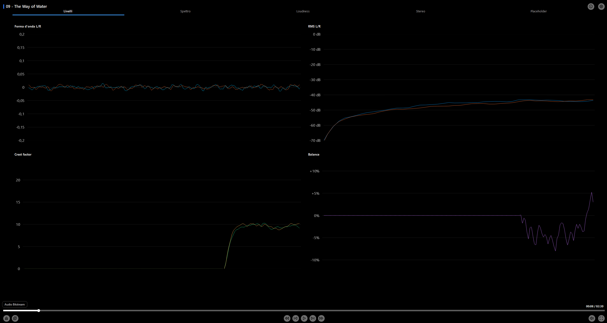
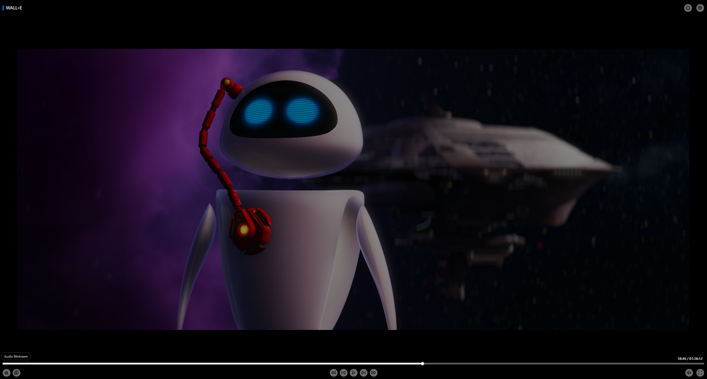
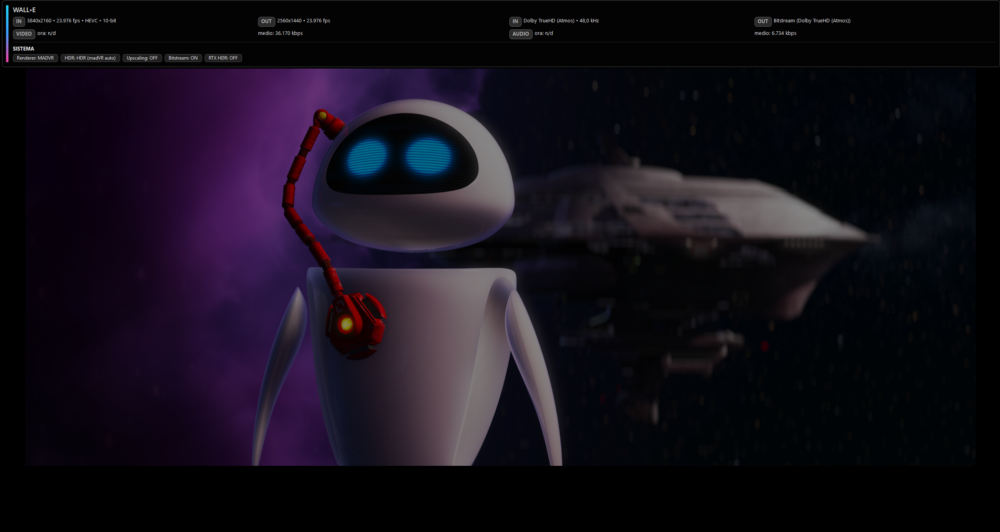
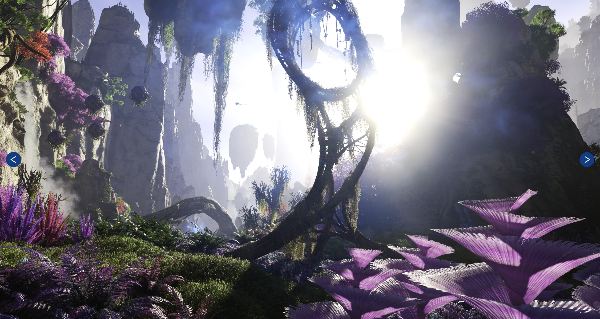
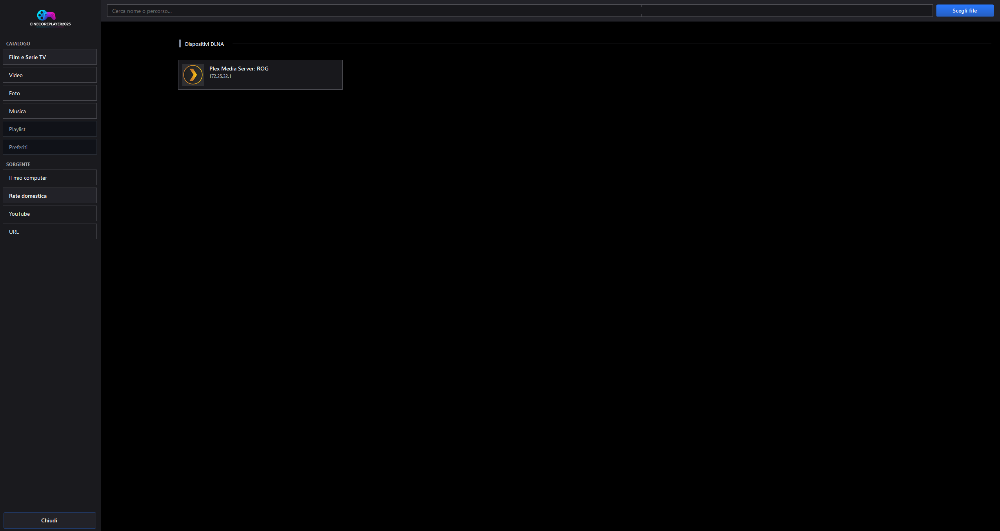
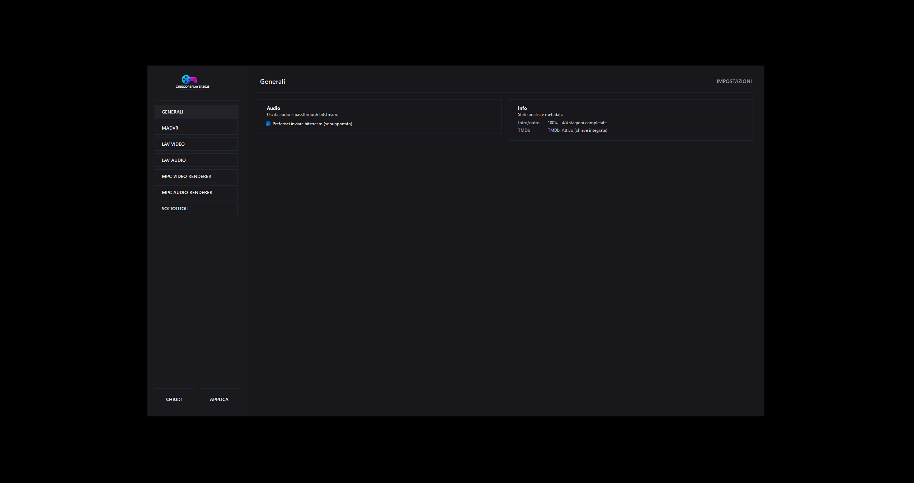

# 🎬 Cinecore Player 2025

A **free**, **non-commercial** media player for **Windows**, built in **C# / .NET 9.0** and powered by **MadVR**.  
It features intelligent **HDR management** and supports multiple high-end **video renderer backends**, including **madVR**, **MPC Video Renderer (MPCVR)**, and **EVR**.

The player also includes a **TMDB-integrated library**, an **online remote controller**, a dedicated **Cinema Mode**, and **resume playback** functionality to continue content from where it was left off.

Designed with **audiophiles** in mind, Cinecore Player includes a dedicated **Audio Mode** with real-time visualizations such as **oscilloscope** and **spectrum analyzer**.  
Audio output supports both **bitstream** and **PCM**, with compatibility for **exclusive** and **non-exclusive** modes.

Beta is set to be released soon. Actual files are not updated, and are in a pretty bad state. I'm uploading the new version soon.

---

## 📸 Screenshots

---

## 📌 Project status (truthful current)

Cinecore Player is currently in **alpha**.  
The core playback experience is already usable, and several advanced features are implemented, but some modules are still incomplete, experimental, or not yet fully polished.
New version isn't on github yet. Current files are an old version different from the photos shown.

---

## 🖥️ System requirements (end users)

- **Operating system:** Windows
- **Runtime:** .NET 9.0
- **Renderer support:** madVR / EVR / MPCVR backend support is present in the player, although not all backends are currently equally functional

---

## ✅ Working features

- **Video playback via madVR and EVR**  
  Core playback is stable on these renderers.

- **Audio playback (PCM & Bitstream)**  
  Standard playback works reliably across supported formats.

- **TMDB-integrated library**  
  The media library includes TMDB integration.

- **Online Remote Control**  
  Remote control functionality is implemented and usable during playback.

- **Cinema Mode**  
  Includes a pre-playback movie placeholder screen, demo playback for **Dolby Atmos / DTS:X MA / THX**, **WLED** integration for turning off room lighting, and then movie playback.

- **Resume playback**  
  Content can be resumed from the point where playback was previously stopped.

- **Audio graphs**
  Functional. 

- **Photo viewer**  
  Fully operational.

- **HUD / On-Screen Display**  
  Generally functional, though still in need of refinement.

- **SKIP Intro/Outro (next episode) for TV Series**  
  Functional.

- **DLNA**  
  Generally functional.

---

## ⚠️ Known issues

- **Renderer settings not yet fully integrated**  
  Player-side configuration panels are still incomplete. Users must currently adjust settings directly inside each renderer.

- **HUD responsiveness and visual glitches**  
  The HUD works, but responsiveness is not yet ideal and occasional graphical artifacts may still occur.

- **MPCVR backend currently not working**  
  MPC Video Renderer support is present at project level, but it is **not currently functional**.

- **YouTube not working**  

---

## 🛠️ In development

- **YouTube integration**
- **Expanded renderer settings**
- **Additional HUD refinements**
- **English localization**
- **General QoL enhancements across the UI**

Many other additions are currently in development.

---
