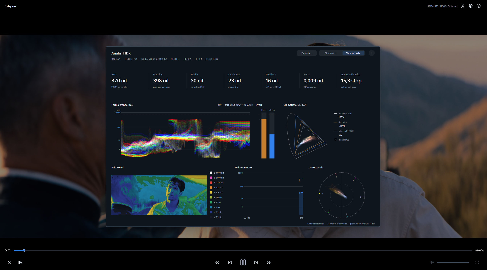

# 🎬 Cinecore Player 2026


[](https://polyformproject.org/licenses/noncommercial/1.0.0)
[](https://dotnet.microsoft.com/)
[](#%EF%B8%8F-system-requirements)
[-yellow)](https://github.com/CinecorePlayer/CinecorePlayer/releases)
[](#-status)
[](https://github.com/CinecorePlayer/CinecorePlayer/releases)
[](https://github.com/CinecorePlayer/CinecorePlayer)
[](#-languages)

Cinecore Player is a **free**, **source-available** and **non-commercial** media player for Windows, built in **C# / .NET 9.0** and focused on high-quality local playback, home-cinema use and a modern media-center experience.

It combines a DirectShow playback path with **libmpv**, **madVR**, **MPC Video Renderer (MPCVR)** and **EVR**, with Blu-ray / DVD / ISO playback, HDR analysis, a TMDb-powered library, a native **Jellyfin** client, its own **audio engine for music**, subtitle download and re-timing, a phone remote, home automations and Cinema Mode.

---

## 🚧 Status

**Beta 3.5 (version 0.3.5)**, a patch on top of Beta 3.

The app is clean and runs without problems in everyday use, and everything described here works. It is still a **beta**: it needs more testing on a wider range of GPUs, renderers, displays, audio devices and networks to find remaining bugs and imperfections, and parts of the interface may change in later versions.

> [!NOTE]
> Some screenshots on this page were taken on earlier versions, so they look slightly different from the latest one (fonts, corners, dialogs and other visual details).

---

## 📥 Download

Download **`CinecorePlayer-Beta3.5-Setup.exe`** from the [Releases page](https://github.com/CinecorePlayer/CinecorePlayer/releases) and run it.

The installer:

- runs in English or Italian and follows the Windows light or dark theme;
- includes Cinecore, the .NET runtime, FFmpeg, libmpv, yt-dlp and libaacs / libbdplus, so nothing else has to be installed first;
- lets you select the optional components one by one: LAV Filters, MPC Audio Decoder, MPC Audio Renderer, madVR, MPC Video Renderer, XySubFilter and, only if it is missing, the WebView2 Runtime (downloaded from Microsoft);
- installs over a previous version, closing Cinecore if it is running;
- registers Cinecore in "Installed apps"; uninstalling also unregisters the filters and leaves your data in `%APPDATA%\CinecorePlayer2025`.

Administrator approval is required for the default Program Files location and for registering the filters. Some bundled third-party installers are unsigned.

From Beta 3 on, an installed copy **updates itself**. Beta 1 and Beta 2 do not: install a newer version once by hand.

> [!NOTE]
> The releases `beta-v0.3.3` and `beta-v0.3.4` were built with the project still numbered 0.3.2, so copies installed from them keep offering 0.3.4. Installing 0.3.5 fixes the numbering. The releases between `beta-v0.3.0` and `beta-v0.3.5` have been deleted.

---

## 🖥️ System Requirements

- **Operating system:** Windows 10 (1809 or later) or Windows 11, x64. Rounded corners and the Segoe UI Variable typeface require Windows 11.
- **Runtime:** none to install; the installer includes the .NET runtime.
- **WebView2 Runtime:** needed for WebView-backed pages; the installer offers it when missing.
- **Video renderers:** libmpv is bundled. madVR, MPC Video Renderer and LAV Filters are optional components offered by the installer. EVR is part of Windows.
- **Protected Blu-rays:** MakeMKV (optional, not bundled) or your own `KEYDB.cfg`.

Advanced video features depend on the renderer, the installed filters, the GPU drivers and the display.

---

## 🎥 Video

### 🎞️ Video Playback

- **DirectShow** playback with **madVR**, **MPC Video Renderer (MPCVR)** or **EVR**, and **libmpv** playback
- Local files, network paths, media URLs and YouTube (through the bundled yt-dlp and FFmpeg)
- Audio-track and subtitle-track selection, **bitstream** and PCM audio output
- HDR, **3D** (madVR and MPCVR, with 3D-to-2D, swap eyes and output format) and upscaling where the renderer and hardware support them
- Automatic refresh-rate switching
- **Volume above 100%** with a limiter, and a per-film volume memory
- Seek timeline with five larger previews, also for network sources
- Picture-in-picture, Skip Intro / Outro and next episode for series, optional fullscreen start
- Menu entries that cannot be used at the moment (for example HDR analysis on a network stream) are disabled instead of failing when clicked
- **Info panel**: live bit rate and dropped frames, plus what the components report (decoder and GPU, audio decoder, audio device, renderer, refresh rate, colour matrix, jitter, mpv outputs and network buffer)

### 🎛️ Renderer & Filter Settings

madVR, LAV Video, LAV Audio, MPC Video Renderer and XySubFilter have settings pages inside Cinecore, in the same style as the player. madVR options such as chroma upscaling, NGU, image doubling, dithering, HDR handling and smooth motion can be changed without opening the madVR panel. The original panels remain available for everything else.


### 💿 Blu-ray, DVD & ISO

- Open `BDMV` / `VIDEO_TS` folders, discs and ISO files from *Open disc*, *Open file*, the library and "Open with"
- **Blu-ray** works with madVR, MPC VR, EVR and mpv; **DVD** with mpv. The main title plays, there is no disc menu
- **ISO** files are mounted read-only by Windows (no administrator rights), with mpv as fallback
- **Protected discs** (AACS / BD+), with no keys included: either **MakeMKV** installed (preferred, required for UHD), or bundled **libaacs + your own `KEYDB.cfg`**, imported from *Settings › Playback › Protected Blu-rays*
- A disc that cannot be decrypted shows a clear message instead of a black screen; malformed discs are rejected safely

### 🖼️ Fullscreen Image: Constant Height / Area

Off by default. *Settings › General › Fullscreen image*, or the **Z** key during playback.

- Modes: **Fill**, **Constant height**, **Constant area**, **Custom** (height ↔ area slider and a relative height per aspect ratio, from 1.33 to 2.40)
- Never distorted, never off screen
- **Black bars inside the frame** are detected without flicker; **IMAX scenes** can use the whole screen
- Adjustable transition (none to 1200 ms); subtitles and OSD follow the picture
- Fullscreen only: windowed mode, PiP, 3D and the pre-film demo stay on "Fill"

### 💬 Subtitles

- Track selection with an explicit **Off**, forced tracks by language, custom position, height on screen and subtitles in the black bars
- **Search and download**: YIFY Subtitles (films), Gestdown / Addic7ed (series), OpenSubtitles with your own key
- **Automatic re-timing** on the film's audio, also stretching between 25 and 23.976 fps; an existing `.srt` can be re-timed too, keeping a copy of the original
- External subtitles load with madVR / XySubFilter and with mpv; the choice is remembered per film
- Saved as `Film.it.srt` next to the video, or in Cinecore's folder when the video folder is read-only
- Only titles and public IDs leave your PC, never file names or paths

### 🌈 HDR Analysis

A sheet for the video being played that shows what the file declares next to what it actually contains.

- **Declared:** MaxCLL, MaxFALL, mastering display, Dolby Vision profile, HDR10+
- **Measured through the whole film:** peak and average luminance on the PQ scale (a click on the chart jumps to that point), luminance distribution, gamut use (Rec.709 / P3 / BT.2020), the absolute maximum next to the 99.99th-percentile peak, median, 90th / 99th percentile, mean luminance, black level, dynamic range in stops and active picture area, with black bars excluded
- **Real time view:** RGB waveform, level bars, CIE 1931 chromaticity diagram, false colour, last-minute history and vectorscope, measured frame by frame; on a PC that cannot decode in real time it steps down by itself to reference frames, then key frames
- **Export** as HTML report, PNG, CSV or JSON
- It uses its own decoder, so it does not depend on the renderer and does not disturb playback; results are cached per file



---

## 🔊 Sound for Video

### 🧪 Audio / Video Synchronization

- Automatic alignment of an external or second audio track over many scenes, with detection of tracks running at a different speed (24 / 23.976 / 25 fps)
- **Delay curve** for tracks whose offset changes during the film: up to 72 points, changes located within about 8 seconds, followed by the player on its own during playback
- Manual delay with a live preview; nothing is saved before Apply
- Experimental: check the result before relying on it


### 🎛️ Network Receiver Control

- Volume and mute for Denon / Marantz, Onkyo / Integra / Pioneer (eISCP), Yamaha MusicCast and UPnP / DLNA RenderingControl
- The device is remembered and checked at startup, and can be found by network search
- **Safe start:** never above the last level used, at most +3 dB per command, and no increase when already above −20 dB
- The slider follows your gesture, so it stays correct even if the receiver was moved with its own remote
- A film's remembered volume only ever lowers a network receiver, never raises it

---

## 🎵 Music

### 🎚️ Cinecore Audio Engine

FFmpeg decoding, high-precision soxr resampling and a double-precision DSP chain, with shared or exclusive WASAPI output. In exclusive mode the device runs at the file's sample rate, bypassing the Windows mixer. The engine can be switched off to use mpv instead.

- Equalizer: 10-band graphic, 31-band third-octave graphic, or parametric (frequency, gain, Q and shape, including shelves), edited on the graph
- ReplayGain per track or album, headphone crossfeed, stereo width, balance, mono sum, loudness compensation
- Clip protection: true-peak limiter plus automatic headroom
- **Crossfade** between tracks (3, 6 or 10 seconds)
- With "PC default" output, playback follows the Windows default device


### 🎶 Music Mode

- Global music player, library navigation and queue management
- **Radio:** when the queue ends, playback continues with similar tracks from your library (same artist, collaborators, nearby years, favourites), with no online service
- Album and track metadata, artist photos, covers and album backgrounds from **TIDAL** and **Spotify** (selectable source, keys stored encrypted)
- Translucent music bar with animated entrance and exit

### 📟 VU Meters & Real-Time Analysis

- Analog-style VU meters with automatic calibration that follows the loudness of the track, or fixed reference levels
- Waveform / oscilloscope, spectrum analyzer, true peak, clipping and limiter readouts
- Loudness (LUFS), RMS level, dynamics, phase correlation and channel balance
- Export of the analysis data; each chart explains what it shows


### 🎤 Lyrics

- Lyrics from LRCLIB, lyrics.ovh and Genius, with a smooth line and word highlighting
- Lyrics without timings are aligned to the audio in the background. Alignment can still be off for alternate versions, live recordings, repeated choruses or songs with a different structure from the reference lyrics. The Python backend is described in `LyricsSynchronizationTests/README.md`

---

## 📚 Library

### 🗂️ Media Library

- Movies, TV series, videos, music and photos, with library scanning and search by title, series or cast, plus an "All sources" filter
- **TMDb** artwork, details and cast; accented titles, English plot when the Italian one is missing, and the server's own data first when Jellyfin is connected
- Home follows the source in use (Computer or Network), and the sidebar marks which one is active
- Favorites, viewing diary, resume and "Continue watching"; titles can be removed from either with a right-click
- **Fix title and cover:** correct the title and year, pick the right film among the TMDb results and one of its covers, or use your own image; "Restore" removes the correction
- **Library report:** number of titles, space and formats, plus duplicates, low resolution or bit rate, inconsistent HDR metadata and unreadable files
- Filters and sorting move to the next option with one click
- Detail sheets open fast and fade in and out; "Play" starts from the beginning, resuming is done from "Continue watching"
- Empty libraries explain what to add; disconnected drives are shown as such

### 🌟 Spotlight

A separate discovery surface with large backdrops, year and runtime, video / HDR and audio-format badges, synopsis and cast, direct **Play** and **Details** actions and a carousel. A **Library / Network** toggle switches its source.

### ⭐ Ratings & Reviews

Movie and series pages show ratings from **IMDb**, **Letterboxd** and **Metacritic**, with reviews and spoiler warnings.


### 📋 Playlists & Queue

- Playlists with name, description and cover, mixing films, series, music and photos
- Editable playback queue, also from the playback overlay; the album sheet can add the whole album to the queue


### 🖼️ Photo Viewer

- Slideshow, wheel zoom, drag to pan and keyboard navigation
- Toolbar: edit, delete (Recycle Bin), share, open with, print, copy, show in folder
- **Editor:** pen, highlighter, line, arrow, rectangle, ellipse, text, eyedropper, colour picker, nine filters and rotation. It always saves a copy


### 🎬 Trakt

- Link an account with a code; no password is typed into the player
- "Recommended for you", split between titles already in the library and titles to find
- Related titles in a film's detail sheet, first those in your library (no account needed)
- Optionally, every finished film is added to your Trakt history; only public IDs, dates and ratings are sent

---

## 📡 Network

### 📡 Jellyfin

Cinecore talks to a Jellyfin server directly, without the DLNA plugin.

- Automatic discovery; sign-in with password or **Quick Connect** (a code entered on a device already signed in)
- Movies, episodes, videos and music arrive with the server's own titles, artwork and technical details; Home is built from the server's titles while it is connected
- The original file is played directly with your renderer and audio path; **selectable quality** converts on the server when you want a lower bit rate, from the right-click menu, the settings or the remote. Changing quality during a film reopens it at the same point
- Progress, resume points and "played" stay in sync with your other devices, and half-watched titles appear in "Continue watching"
- Films watched from Jellyfin reach your Trakt history through the TMDb id declared by the server
- The token is stored encrypted and never written to the log, the history or the resume file; removing the server signs out and revokes it

### 🌐 DLNA / UPnP & Network Page

- DLNA / UPnP servers (Plex and others) can be browsed and played alongside local files, network paths and URLs
- The Network page lists only servers with a catalogue to browse, Jellyfin and Plex first, with favourites and automatic address follow-up (a server that changes IP keeps one entry; entries silent for a week are removed)
- HDR analysis, subtitle download, audio alignment and per-film volume need files on the PC, not network streams

---

## 🏠 Home Cinema

### 📱 Browser Remote

- A browser remote for phones and tablets on the local network: playback, queue, library (Computer / Network), audio and subtitle tracks, Spotlight with D-pad, renderer and audio settings, and a **Player** page with Jellyfin quality and the fullscreen-image options
- **QR pairing:** the interface dims and only the code remains; on first launch the player offers to pair your phone. Saved to the phone's Home screen, the remote gets its own icon

### 🍿 Cinema Mode

- Pre-film screen with the film's artwork, optional demo clip and automatic transition to the film
- **WLED** room lights, with their own settings sheet and a live connection check

### 🏠 Home Automations

Rules that send a command when playback **starts, pauses, resumes, stops** or reaches the **end credits**: an HTTP request (Home Assistant, Shelly, Hue bridge and anything with a URL) or an MQTT message. Rules can be limited to video, tested from the sheet, and use the title, position and duration in the message.

---

## ⚙️ App

### 🔄 Updates

- **Cinecore:** checked once a day shortly after startup, only when nothing is playing; the update sheet shows the release notes, and size and SHA-256 are verified against the values published by GitHub. A version can be skipped and the check switched off; development builds and portable copies never replace themselves
- **External components** (*Extra › External components…*): yt-dlp updates itself; LAV Filters and MakeMKV on request, with SHA-256 verification. Installers never start by themselves. madVR, MPC VR, XySubFilter, libmpv and FFmpeg update with the player

### 🔒 Security

- Keys, tokens and passwords are stored encrypted (Windows DPAPI); nothing is kept in clear text in the configuration or logs
- Remote pairing does not reveal the PIN, throttles wrong PINs, accepts commands only from the remote page and refuses oversized requests
- URLs and searches passed to yt-dlp cannot inject options or commands

### 🎨 Interface & Settings

- Modern typography, anti-aliased rounded corners on Windows 11, smooth animations and no banding in gradients
- Animated detail and album sheets, cross-fade between pages, and one glass material shared by the music bar, the queue and the menus
- Light and dark mode, accent colour
- Player, renderer, audio and startup options (including fullscreen start)
- TMDb, Spotify and TIDAL credentials, stored encrypted, with a built-in key or a personal one

### 🌍 Languages

The interface is available in 🇬🇧 **English** and 🇮🇹 **Italian**. On first start it follows Windows, and it can be changed in the settings.

---

## 📸 Screenshots

The screenshots below were taken on Beta 1 and have not all been updated to the latest version: the layout is the same, but fonts, corners, dialogs and some details look slightly different today.

### 🏠 Home, Library & Discovery

#### Home


#### Film Library


#### Movie Details


#### Viewing Diary


### 🎵 Music, Player & Audio Analysis

#### Music Home


#### Album / Track View & Global Player


#### Real-Time Audio Analysis


#### Lyrics


### 🌐 Network & Remote Control

#### DLNA Server Selection


#### Browser Remote


### ⚙️ Settings

#### General Settings


---

## ⚠️ Known Limitations

Cinecore is a beta: it needs more testing across hardware and setups, and parts of the interface may change.

- **Discs:** decryption of protected Blu-rays and DVD playback have never been tested on a real disc (unprotected Blu-ray folders and ISO files are tested). No disc menu, no timeline previews for discs; UHD needs MakeMKV
- **Video:** behaviour can differ between madVR, MPCVR, EVR and mpv; HDR handling and refresh-rate switching need more testing
- **Fullscreen image:** with madVR / MPC VR / EVR the picture is not enlarged beyond the screen (mpv does); black-bar detection works on local files only; the EVR scale has not been measured on screen
- **HDR analysis:** an estimate from sampled key frames, so a peak lasting a few frames can be missed. The real-time view measures every frame only if the PC can decode the film a second time alongside playback. Dolby Vision profile 5 cannot be measured
- **Audio:** the Cinecore Audio Engine is relatively new and exclusive output depends on the device and driver; crossfade needs shared output; lyrics can lose alignment on difficult tracks; automatic audio alignment is experimental; receiver control is verified on a Marantz, other devices depend on the protocol
- **Network:** Jellyfin tested with 10.11, network music plays through mpv, photos and live TV are not listed; DLNA depends on the server and the network
- **Services:** subtitle sources are third-party sites and can change or stop working; ratings, metadata and lyrics depend on external providers
- **Other:** the Windows share panel for photos only appears while the player is in the foreground; automatic updates work only for installed copies; some bundled third-party installers are unsigned; long sessions and unusual media combinations need more testing

---

## 🕑 Version History

Release notes for each version are on the [Releases page](https://github.com/CinecorePlayer/CinecorePlayer/releases).

### Beta 3.5 (0.3.5), patch

- Blu-ray, DVD and ISO playback; external components update; fullscreen image (constant height / area)
- Photo toolbar and editor; new audio and subtitle aligners with delay curve; safe receiver volume
- Volume above 100%, fullscreen start, TIDAL artwork, selectable Jellyfin quality, QR pairing
- Fix title and cover, redesigned Info panel and dialogs, many fixes to HUD, remote, Spotlight and receiver volume

### Beta 3 (0.3.0)

- Automatic updates, native Jellyfin client, Trakt, subtitle search and re-timing, HDR analysis
- Home automations, crossfade and radio, library report, Network page with favourites
- Encrypted keys and tokens, hardened remote pairing

### Beta 2

- Cinecore Audio Engine, VU meters, native renderer settings pages, 3D playback
- IMDb / Letterboxd / Metacritic ratings, multi-scene audio alignment, playlist sheet, Genius lyrics, photo viewer
- New Inno Setup installer in English and Italian

### Beta 1

- TMDb library, Spotlight, diary and resume, DirectShow and mpv playback, YouTube and DLNA
- HDR and bitstream controls, seek previews, music player and lyrics, browser remote, Cinema Mode with WLED

---

## 🛠️ Building from Source

Requires the **.NET 9 SDK**:

```powershell
dotnet restore CinecorePlayer2025.csproj
dotnet build CinecorePlayer2025.csproj -c Release
```

Run:

```text
bin/Release/net9.0-windows10.0.19041.0/CinecorePlayer2025.exe
```

Keep the **entire output directory**: the executable alone does not contain the native DLLs, filters and helper tools. Optional backends must be in the expected `third-parties` locations or installed on the system.

To build the installer, install **Inno Setup 6.6 or later**, set `<Version>` and `<InformationalVersion>` in `CinecorePlayer2025.csproj` **before** building, then run:

```powershell
powershell -ExecutionPolicy Bypass -File .\installer\Build-Installer.ps1
```

The installer and `SHA256SUMS.txt` are written to `artifacts\installer`, and the script prints the release tag to use.

---

## 🧪 Bug Reports & Feedback

The code is checked with deterministic lyrics-synchronization tests, a UI test bench (`artifacts/ui-qa`), measured DSP and decoder checks and playback regression checks, and the main features are verified on real files and hardware. Reports from other setups are what helps most.

If you find a bug or have an idea, open an **Issue** on GitHub. For playback issues, include:

- Windows version and display scaling
- GPU and renderer
- Audio output mode (shared, exclusive or bitstream) and device
- Media format and resolution
- Exact steps to reproduce

Remove personal paths, tokens and credentials from any log excerpt before posting it.

---

## 📄 License

Cinecore Player's original code is distributed under the **PolyForm Noncommercial 1.0.0 License**: it may be used, modified and studied under the conditions of the license, and commercial use is not permitted. See [`LICENSE`](LICENSE).

Third-party software keeps its own licenses. FFmpeg, libmpv and MPC Video Renderer are GPL-licensed; libaacs and libbdplus (bundled MSYS2 builds) are LGPL-licensed. See [`THIRD-PARTY-CREDITS.md`](THIRD-PARTY-CREDITS.md) and the notices under `third-parties`.

---

## ⭐ Support the Project

If you like Cinecore Player, consider leaving a **⭐ Star** on the repository. It helps other users discover the project.

---

**Cinecore Player**  
*A modern Windows media player focused on playback quality, customization and the home-cinema experience.*
