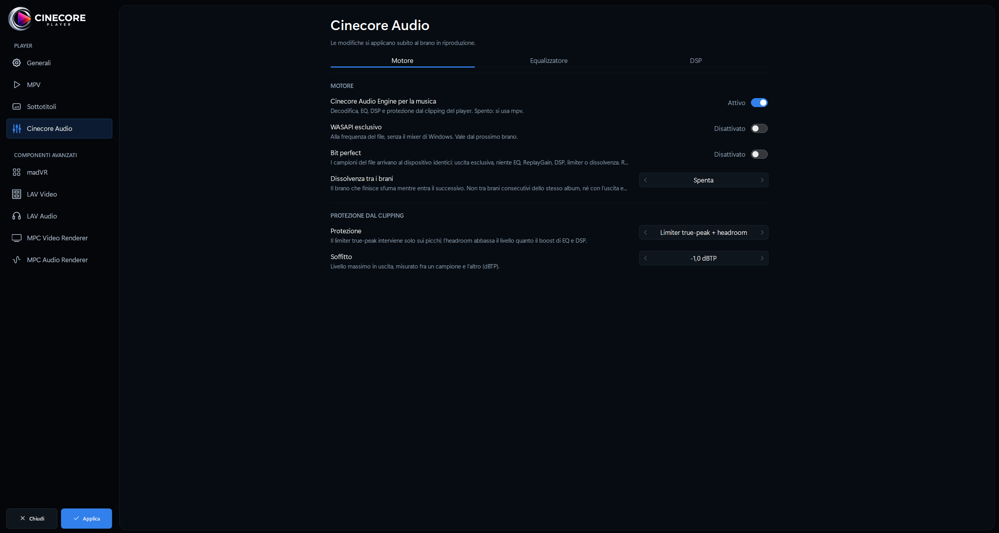
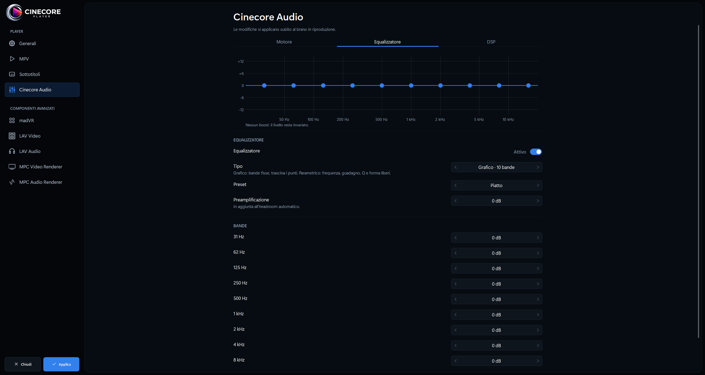
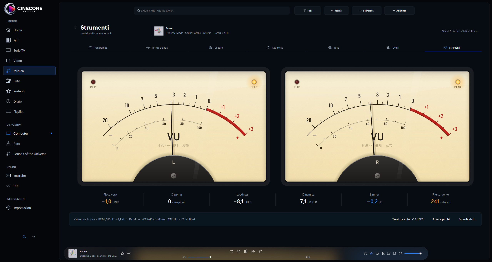
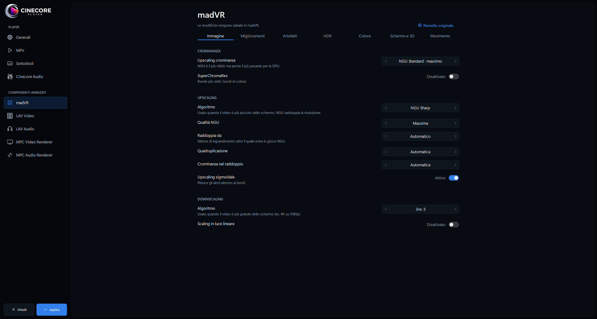
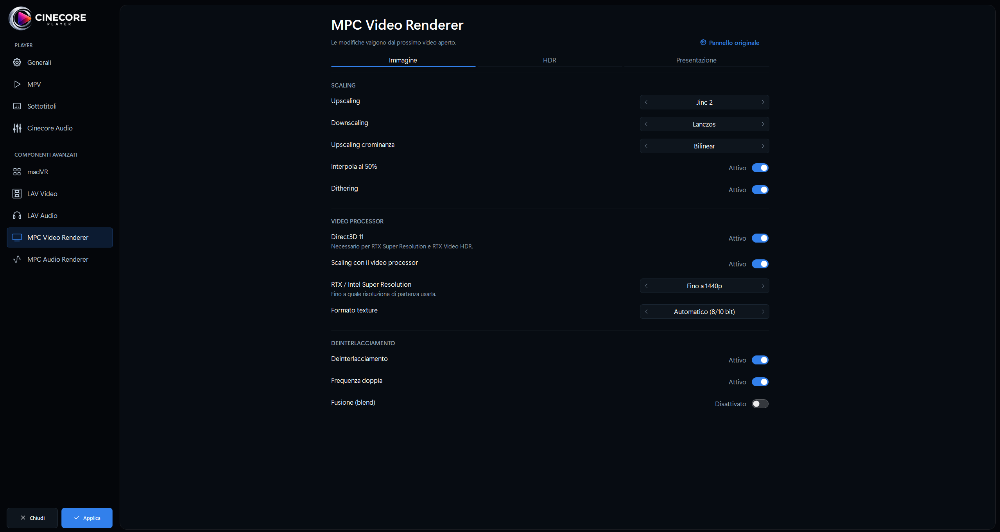
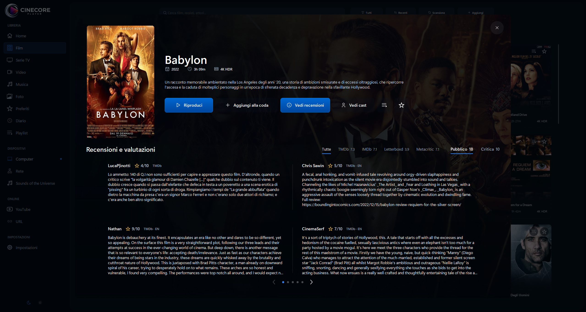
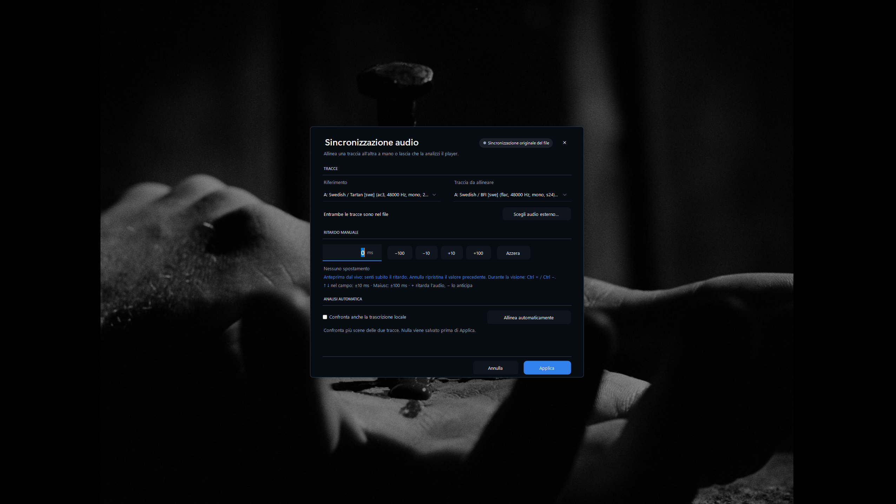
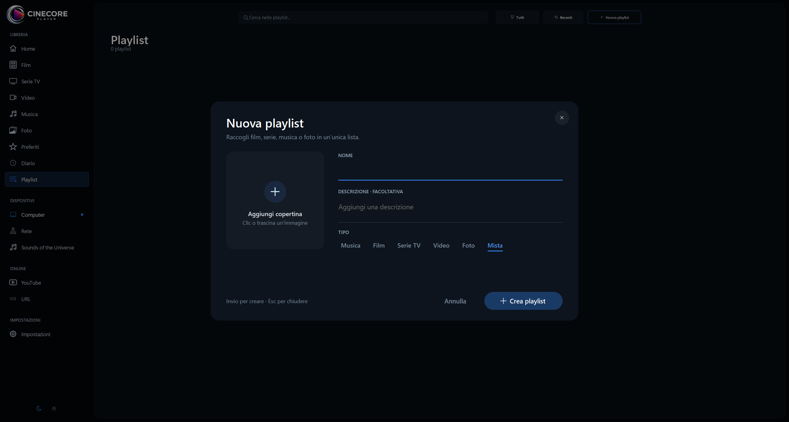
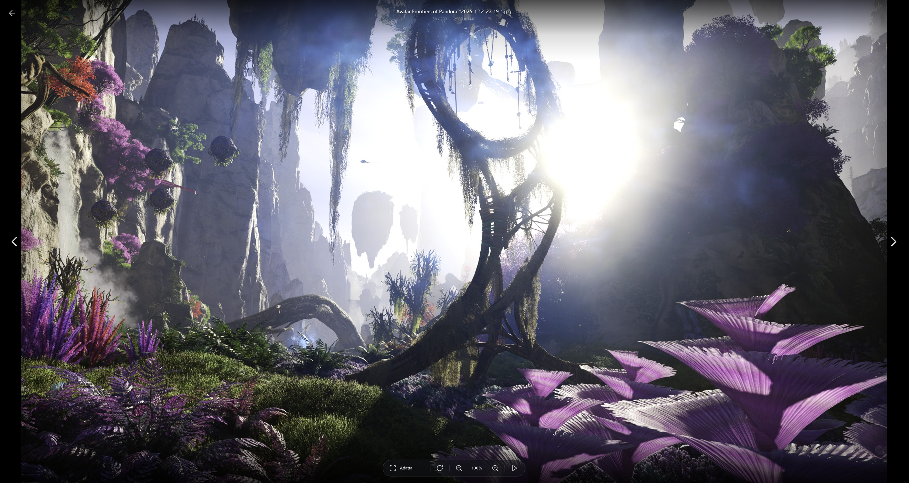

# 🎬 Cinecore Player 2026

[](https://polyformproject.org/licenses/noncommercial/1.0.0)
[](https://dotnet.microsoft.com/)
[](#%EF%B8%8F-system-requirements)
[](#-beta-3)
[](#%EF%B8%8F-beta-3-limitations)
[](https://github.com/CinecorePlayer/CinecorePlayer/releases)
[](https://github.com/CinecorePlayer/CinecorePlayer)
[](#-localization)

Cinecore Player is a **free**, **source-available**, and **non-commercial** media player for Windows, built in **C# / .NET 9.0** and focused on high-quality local playback, home-cinema use and a modern media-center experience.

Cinecore combines a DirectShow-based playback path with **libmpv**, renderer support for **madVR**, **MPC Video Renderer (MPCVR)** and **EVR**, HDR handling and analysis, a TMDb-powered media library, a native **Jellyfin** client, its own **audio engine for music**, real-time audio analysis, subtitle download, browser remote control, home automation hooks and Cinema Mode.

> ### 🚧 Development status
> **Beta 3 (version 0.3.0) is the current version of Cinecore Player.** It builds on Beta 2 and adds automatic updates, subtitle search and download with automatic re-timing, HDR analysis (whole film and live), Trakt, home automations, crossfade and radio for music, a library report, and a long list of fixes.
>
> Beta 3 is still an **experimental development build and is not production-ready**. It has not been validated across the full range of GPUs, renderers, displays, audio devices and network setups. Bugs, renderer-specific behavior and rough edges should be expected.

---

## 📥 Download

Download **`CinecorePlayer-Beta3-Setup.exe`** from the [Releases page](https://github.com/CinecorePlayer/CinecorePlayer/releases) and run it.

From Beta 3 on, an installed copy **updates itself**: it checks the releases once a day, shows what is new and, if you accept, downloads the installer, verifies it against the checksum published by GitHub and installs it. Beta 1 and Beta 2 do not have this: install Beta 3 once by hand.

The installer:

- runs in English or Italian and follows the Windows 11 light or dark theme;
- includes Cinecore, the .NET runtime, FFmpeg, libmpv and yt-dlp, so nothing else has to be installed first;
- lets you select the optional third-party components one by one: LAV Filters, MPC Audio Decoder, MPC Audio Renderer, madVR, MPC Video Renderer, XySubFilter and, only if it is missing, the WebView2 Runtime (downloaded from Microsoft);
- installs over a previous version, closing Cinecore if it is running;
- registers Cinecore in "Installed apps"; uninstalling also unregisters the filters and leaves your data in `%APPDATA%\CinecorePlayer2025`.

Administrator approval is required for the default Program Files location and for registering the filters. Some bundled third-party installers are unsigned and open with their own setup windows.

---

## 🆕 New in Beta 3

### 🔄 Automatic Updates

An installed copy checks the GitHub releases shortly after startup, at most once a day, and offers a newer version only when nothing is playing. The update sheet shows the release notes; "Update now" downloads the installer, checks its size and SHA-256 against the values published by GitHub, and runs it without the wizard. Windows asks for consent, the files are replaced and Cinecore restarts. A version can be skipped, and the check can be switched off from the menu. Development builds and portable copies never replace themselves.

### 💬 Subtitle Search, Download & Re-timing

- Search for the film or episode being played: YIFY Subtitles for films, Gestdown (the Addic7ed catalogue) for series, and OpenSubtitles when you add your own key
- The downloaded subtitle is **re-timed on the film's audio** before it is saved: the dialogue is located in the audio and the subtitle is shifted, and stretched when it was made for another frame rate (25 vs 23.976 fps)
- An existing `.srt` can be re-timed the same way; it is rewritten only when the analysis is reliable, and a copy of the original is kept
- Subtitles are saved next to the video as `Film.it.srt`, or in Cinecore's own folder when the video folder is read-only (network shares, read-only mounts)
- External subtitles load with madVR / XySubFilter and with mpv; the choice is remembered per film
- Only titles and public IDs are sent to the subtitle services, never file names or paths

### 🌈 HDR Analysis

A sheet for the video being played shows what the file declares (MaxCLL, MaxFALL, mastering display, Dolby Vision profile, HDR10+) next to what it actually contains:

- peak and average luminance through the whole film, measured on sampled frames, on the PQ scale; a click on the chart jumps to that point
- luminance distribution, and how much of the picture stays within Rec.709, uses P3 or reaches BT.2020
- more figures for the whole film: absolute maximum next to the 99.99th-percentile peak, median, 90th and 99th percentile, black level, mean luminance (Y), dynamic range in stops and the active picture area; black bars are detected and left out, so averages and black level describe the picture only
- **Real time** view: the film is decoded frame by frame alongside playback and every frame is measured as it reaches the screen, with
  - an **RGB waveform** on the PQ scale
  - peak and average **level bars** with the declared MaxCLL and the highest peak seen
  - a **CIE 1931 chromaticity diagram** with the Rec.709, P3 and BT.2020 triangles and the share of the picture inside each
  - a **false-colour** picture by luminance band
  - the **last minute** of peak and average
  - a **vectorscope**
- on a computer that cannot decode in real time the view steps down by itself to reference frames, then to key frames
- **Export**: an HTML report with every figure and the charts of both views, a PNG of the current view, the samples as CSV or all measurements as JSON

The analysis uses its own decoder, so it does not depend on the renderer and does not disturb playback. Results are cached per file.

### 🎬 Trakt

- Connect a Trakt account with a code; no password is typed into the player
- "Recommended for you": personal recommendations, split between titles already in the library and titles to find
- The recommendations in a film's detail sheet put first the library titles Trakt considers related to it (no account needed)
- Optionally, every finished film is added to the Trakt history; only public title IDs, dates and ratings are sent

### 📡 Jellyfin

Cinecore talks to a Jellyfin server directly, without the DLNA plugin:

- servers on the local network are found automatically and appear in the Network page next to DLNA servers; a server elsewhere can be added by address
- the Network page lists only servers that have a catalogue to browse (Jellyfin, Plex, other DLNA servers), with Jellyfin and Plex first; servers can be starred as favourites and stay on top; a server that changes IP address keeps a single entry that follows it, and entries that have not answered for a week are removed
- Home follows the source in use: with a server connected it is built from the server's titles, and the sidebar marks whether Computer or Network is active
- sign in with user name and password, or with **Quick Connect**: the player shows a code to enter in Jellyfin on a device that is already signed in, and no password is typed into the player
- movies, episodes, videos and music arrive with the server's own titles, overviews, genres, artwork and technical details (resolution, HDR / Dolby Vision, audio format)
- the original file is played directly, with the renderer and audio path you already use (madVR, bitstream, Cinema Mode with its pre-film screen)
- start, progress, pause and stop are reported to the server: resume points and "played" stay in sync with your other devices, and titles left half-way appear in "Continue watching"
- the access token is stored encrypted and is never written to the log, the history or the resume file; removing the server signs out and revokes it
- films watched from Jellyfin reach the Trakt history through the TMDb id declared by the server

### 🏠 Home Automations

Rules that send a command to a device when playback **starts, pauses, resumes, stops** or reaches the **end credits**: an HTTP request (Home Assistant, Shelly, Hue bridge and anything with a URL) or an MQTT message. Rules can be limited to video, tested from the sheet, and use the title, position and duration in the message. The WLED settings have their own sheet with a live connection check.

### 🎵 Music: Crossfade, Radio, Default Device

- **Crossfade** between tracks (3, 6 or 10 seconds) with the Cinecore Audio Engine; consecutive tracks of the same album are still joined without overlap
- **Radio**: when the queue ends, playback continues with similar tracks from the library (same artist and collaborators, nearby years, favourites), without any online service
- With output on "PC default", playback follows the Windows default device when it changes (headphones plugged in, switch to the TV)
- New translucent music bar that lets the page show through, with animated entrance and exit
- When the music stops, the library stays where it was instead of going back to the top

### 📚 Library

- **Library report**: number of titles, space and formats, plus what deserves a look: duplicates, low resolution or bitrate, HDR files with missing or inconsistent luminance metadata, files that do not open
- **Per-film volume**: a volume changed during a film is remembered for that film; a network receiver is only ever lowered, never raised, by the player
- Detail and album sheets fade in and out, and open noticeably faster
- Moving between Home, the categories and Network cross-fades: the previous page stays on screen until the new one, artwork included, is ready
- Network page: Jellyfin and Plex servers are listed first, servers can be marked as favourites, a server that changed address is followed instead of being listed twice, and devices not seen for a week are dropped
- Home keeps the network source when a server is connected, and the sidebar marks the source in use (Computer or Network)
- Music bar, queue and right-click menu share one glass material: a neutral, lightly tinted blur of what is behind, the same over the whole surface
- Music overview: the four figures sit in one card, with fewer separator lines
- **Playback info panel**: next to the values measured by the player it now shows what the components themselves report: the video decoder in use and the graphics card it runs on (LAV Video), what the audio decoder receives and produces (LAV Audio), the audio device, renderer version, exclusive mode, real output rectangle, display refresh rate, colour matrix and levels (madVR), frames presented and dropped, jitter (madVR, MPC Video Renderer, EVR), and for mpv its version, outputs, hardware decoding and network buffer. Network streams (Jellyfin, DLNA, HTTP/HTTPS, YouTube) show their origin, container, size and bit rates too
- "Play" in the detail sheet starts from the beginning; resuming is done from "Continue watching"
- "Add the whole album to the queue" in the album sheet
- Menu entries that cannot be used at the moment are disabled instead of failing when clicked: HDR analysis and subtitle download for network streams, upscaling and HDR profiles without madVR, renderers that are not installed, audio synchronization while music is playing, crossfade when another audio engine is in use

### 🔒 Security

- API keys, tokens and passwords are stored encrypted (Windows DPAPI for user data); nothing is kept in clear text in the configuration or in the logs
- Browser remote: pairing does not reveal the PIN, wrong PINs are throttled, commands are accepted only from the remote page, oversized requests are refused
- URLs and searches passed to yt-dlp cannot inject options or commands

### 🛠️ Fixes

- Subtitles: "Off" now works with madVR
- Browser remote: with nothing playing it no longer shows the title of a film that was never started
- Spotlight: only one item is highlighted at a time when navigating from the remote or the keyboard
- Exception when closing the player (default audio device watcher released twice)
- Lyrics: tracks without lyrics, or whose alignment had been rejected, were looked up again at every visit to Music, slowing the library down
- Detail sheet: first frame, animation and redraws were slow at high resolutions
- The pre-film screen shows "powered by madVR" only when the film will really start with madVR
- Detail sheet layout: equal margins and centred content
- Music bar: time labels aligned, theme change applied immediately, no flash when it leaves
- Context menu over madVR in fullscreen: the glass was built from a screen capture that showed the desktop behind the video (wrong tint, mismatched corners); it now uses a frame of the film
- Sidebar: a category stayed highlighted together with Network
- Trakt: a title played from a network address is no longer guessed from the address
- Music bar: half grey, half blue tint and visible banding
- Placeholder artwork: banded gradient
- Search bar: during a change of page the text box could show as a rectangle of another colour
- Home went back to the computer library while a network server was connected
- Playback info: with YouTube the panel stopped updating after the video opened; Dolby Vision is recognised from the stream, not from the file name
- Changing theme from the audio graphs or the lyrics view sent back to the music library

---

## 🆕 New in Beta 2

<!--
  Screenshots for this section go in Screenshots/ with the file names used below.
  Add the image with that exact name and it appears here; delete the line for any
  screenshot you decide not to include.
-->

### 🎚️ Cinecore Audio Engine

Music now plays through Cinecore's own engine: FFmpeg decoding, high-precision soxr resampling and a double-precision DSP chain, with shared or exclusive WASAPI output. In exclusive mode the device runs at the file's sample rate, bypassing the Windows mixer. The engine can be switched off to use mpv instead.

- Equalizer: 10-band graphic, 31-band third-octave graphic, or parametric (frequency, gain, Q and shape, including low and high shelf), edited directly on the graph
- ReplayGain per track or per album, with preamp
- Headphone crossfeed, stereo width, balance and mono sum
- Loudness compensation for low-volume listening
- Clip protection: true-peak limiter plus automatic headroom





### 📟 VU Meters & Analysis

Analog-style VU meters with automatic calibration that follows the loudness of the track, or fixed reference levels. Readouts cover true peak, clipping, loudness (LUFS), dynamics and limiter activity, and the analysis data can be exported. Each chart now explains what it shows.



### 🎛️ Native Renderer & Filter Settings

madVR, LAV Video, LAV Audio, MPC Video Renderer and XySubFilter have settings pages inside Cinecore, in the same style as the player's own settings. madVR options such as chroma upscaling, NGU, image doubling, dithering, HDR handling and smooth motion can be changed without opening the madVR panel. The original panels remain available for everything else.





### ⭐ Ratings & Reviews

Movie and series pages show ratings from **IMDb**, **Letterboxd** and **Metacritic**, with Letterboxd and Metacritic reviews and spoiler warnings.



### 🧪 Audio Synchronization

Automatic alignment compares several scenes of the two tracks, using audio correlation and, optionally, a local transcription. It detects tracks that run at a different speed (24 vs 23.976 fps, PAL 25 fps) and reports when a fixed delay cannot align them. The manual delay has a live preview, and nothing is saved before Apply.



### 📚 Library & Playlists

- New playlist sheet with name, description and cover; a playlist can mix films, series, music and photos
- Search by title, series or cast, and an "All sources" filter
- Empty libraries explain what to add; disconnected drives are shown as such
- Artist photos and album backgrounds in the music library
- TMDb and Spotify credentials are set in Settings, with a built-in key or a personal one



### 🖼️ Photos, Lyrics & Interface

- Reworked photo viewer: slideshow, wheel zoom, drag to pan, arrow-key navigation
- Genius added as a lyrics source; a new lyrics clock makes line changes and word highlighting smooth
- 3D playback through madVR and MPC Video Renderer, including 3D-to-2D, swap eyes and output format
- Subtitle position options: custom position, height on screen, moving subtitles into the black bars
- Spotlight is fully navigable from the phone remote, and the remote exposes the new audio and renderer settings
- New typography, anti-aliased rounded corners on Windows 11, smoother transitions and no banding in gradients
- The interface starts in Italian when Windows is in Italian, otherwise in English



---

## 📸 Screenshots

The screenshots below were taken on Beta 1. The layout of these screens is the same in Beta 3; fonts, corners and some details have changed.

### 🏠 Home, Library & Discovery

#### Home


#### Spotlight

**Spotlight** is a separate discovery surface for featured media. It presents each title with large backdrop artwork, year and runtime, video/HDR and audio-format badges, synopsis and cast, with direct **Play** and **Details** actions and a carousel to move between titles.


#### Film Library


#### Movie Details


#### Viewing Diary


### 🎵 Music, Player & Audio Analysis

#### Music Home


#### Album / Track View & Global Player


#### Real-Time Audio Analysis


#### Lyrics


### 🌐 Network & Remote Control

#### DLNA Server Selection


#### Browser Remote


### ⚙️ Settings

#### General Settings


---

## ✨ Features

### 🎞️ Media Library

Libraries for movies, TV series, videos, music and photos:

- Library scanning and search by title, series or cast
- **TMDb metadata**: artwork, details and cast
- Ratings and reviews from IMDb, Letterboxd and Metacritic
- Trakt: personal recommendations, related titles, optional history sync
- Library report: duplicates, low quality, inconsistent HDR metadata, unreadable files
- Spotlight carousel for featured titles
- Favorites and viewing diary/history
- Resume playback and continue watching
- Playlists that can mix media types
- Editable playback queue, also from the playback overlay

### 🎥 Video Playback

Playback paths and renderers:

- **DirectShow** playback with **madVR**, **MPC Video Renderer (MPCVR)** or **EVR**
- **libmpv** playback
- Local files, network paths, media URLs and YouTube sources (through the bundled yt-dlp and FFmpeg)

Playback functions:

- Audio-track and subtitle-track selection
- HDR, 3D and upscaling options where the active renderer and hardware support them
- Bitstream output
- Native settings pages for madVR, LAV, MPC Video Renderer and XySubFilter
- HDR analysis of the playing file: declared metadata, measured luminance through the film, real-time scopes of the current frame (waveform, chromaticity, vectorscope, false colour), export of results and charts
- Per-film volume memory
- Seek timeline with five previews
- Picture-in-picture mode
- On-screen controls, overlays and a playback-information panel
- Automatic refresh-rate switching

### 💬 Subtitles

- Track selection with an explicit **Off** state
- Forced-track selection based on language
- Position options: custom position, height on screen, subtitles in the black bars
- Search and download for the playing film or episode, with automatic re-timing on the audio
- Re-timing of an existing `.srt`

### 🔊 Audio

- **Cinecore Audio Engine** for music, with equalizer, ReplayGain, crossfeed, stereo image controls, loudness compensation and clip protection
- Shared or exclusive WASAPI output
- Crossfade between tracks
- Output follows the Windows default device
- PCM and bitstream output for video
- Audio-track selection
- Volume and mute control of a network receiver (Denon/Marantz, Onkyo/Integra/Pioneer eISCP, Yamaha MusicCast, UPnP/DLNA RenderingControl)

### 🧪 Audio / Video Synchronization

- Automatic alignment of an external or second audio track, based on audio correlation and optional local transcription
- Detection of tracks that run at a different speed
- Manual delay with live preview

These controls are **experimental**. Automatic alignment is not guaranteed to be correct for every file, dub or edit; check the result before relying on it.

### 🎵 Music Mode

- Global music player and music-library navigation
- Queue management
- Radio: similar tracks from the library when the queue ends
- Lyrics from LRCLIB, lyrics.ovh and Genius, with automatic synchronization
- Album and track metadata, artist photos and album backgrounds

### 📊 Real-Time Audio Analysis

- Waveform / oscilloscope
- Spectrum analyzer
- VU meters with true peak, clipping and limiter readouts
- Loudness (LUFS), RMS level and dynamics
- Phase correlation and channel balance
- Export of the analysis data

### 🎤 Lyrics Synchronization

Lyrics without timings are aligned to the audio in the background. Synchronization can still be off for alternate versions, live recordings, repeated choruses and songs whose structure differs from the reference lyrics. The Python backend is described in `LyricsSynchronizationTests/README.md`.

### 📱 Browser Remote Control

A browser-based remote for phones and tablets on the local network:

- Playback state and controls
- Queue and library access
- Audio-track and subtitle-track selection
- Spotlight navigation with D-pad, OK and Back
- Audio engine and renderer settings

### 🍿 Cinema Mode

- Pre-playback placeholder screen with the movie's artwork
- Optional pre-movie demo clip
- **WLED** integration for room-light control
- Automations: HTTP or MQTT commands on start, pause, resume, stop and end credits
- Automatic transition to the selected movie

### ⏭️ Skip Intro / Outro

TV-series playback can skip intros and outros and move on to the next episode.

### 🖼️ Photo Viewer

Photo browsing with slideshow, zoom, pan and keyboard navigation.

### 📡 Jellyfin, DLNA & Network Media

- **Jellyfin**: native client with automatic discovery, sign-in by password or Quick Connect, server metadata and artwork, direct play, resume and played state in sync with the server
- **DLNA/UPnP** servers (Plex and others) can be browsed and played alongside local files, network paths and URLs. Behavior varies with the network and the server.
- Functions that need the file itself (HDR analysis, subtitle download and re-timing, automatic audio alignment, per-film volume) are available for files on the PC, not for network streams

### ⚙️ Settings

- Player, renderer and audio options
- TMDb and Spotify credentials, stored encrypted
- Automatic updates, with the check at startup optional
- Light and dark mode, accent color
- Italian and English interface

---

## 🌍 Localization

Cinecore Player supports two interface languages:

- 🇬🇧 **English**
- 🇮🇹 **Italian**

On first start the interface is Italian when Windows is in Italian and English otherwise. The language can be changed in the application settings.

---

## 🖥️ System Requirements

### End users

- **Operating system:** Windows x64. Rounded window corners and the Segoe UI Variable typeface require Windows 11.
- **Runtime:** none to install; the installer includes the .NET runtime.
- **WebView2 Runtime:** needed for WebView-backed pages; the installer offers it when it is missing.
- **Video renderers:** libmpv is bundled. madVR, MPC Video Renderer and LAV Filters are optional components offered by the installer. EVR is part of Windows.

Advanced video features depend on the selected renderer, the installed filters, the GPU drivers and the display.

### Building from source

Building Cinecore requires the **.NET 9 SDK**:

```powershell
dotnet restore CinecorePlayer2025.csproj
dotnet build CinecorePlayer2025.csproj -c Release
```

Run:

```text
bin/Release/net9.0-windows/CinecorePlayer2025.exe
```

Keep the **entire output directory**: the executable alone does not contain the native DLLs, filters, resources and helper tools the application needs. Optional backends must be in the expected `third-parties` locations or installed on the system.

To build the installer, install **Inno Setup 6.6 or later** and run:

```powershell
powershell -ExecutionPolicy Bypass -File .\installer\Build-Installer.ps1
```

The installer and `SHA256SUMS.txt` are written to `artifacts\installer`.

---

## ⚠️ Beta 3 Limitations

Beta 3 is a development build, not finished software.

- Playback behavior can differ between madVR, MPCVR, EVR and libmpv
- HDR handling and refresh-rate switching need testing on more configurations
- The Cinecore Audio Engine is new; exclusive output depends on the audio device and driver
- Native renderer and filter pages cover the main options, not every setting of the original panels
- Synchronized lyrics can lose alignment on difficult tracks
- Automatic audio alignment is experimental
- Subtitle sources are third-party sites and can change or stop working; automatic re-timing is skipped when the analysis is not reliable
- The whole-film HDR analysis is an estimate from sampled key frames: a peak lasting a few frames can be missed. The real-time view measures every frame only if the computer can decode the film a second time alongside playback; otherwise it follows reference or key frames. Frames are measured on a reduced grid (one pixel in four across on 4K). Dolby Vision profile 5 cannot be measured
- Crossfade needs the Cinecore Audio Engine with shared output
- Automatic updates work from Beta 3 on and only for installed copies
- Jellyfin: the original file is always played directly, there is no transcoding; music from the network plays through mpv, not through the Cinecore Audio Engine; photos and live TV are not listed; tested with Jellyfin 10.11
- Ratings, reviews, metadata and lyrics depend on external providers and on the network
- DLNA behavior depends on the server and the network
- Some bundled third-party installers are unsigned
- Long sessions and unusual media combinations need more stability testing

---

## 🚧 Beta 3

**Cinecore Player Beta 3 (0.3.0)** is the current development generation.

### Added in Beta 3

- Automatic updates from the GitHub releases, with checksum verification
- Native Jellyfin client: discovery, password or Quick Connect sign-in, server metadata, direct play, resume and played state in sync
- Subtitle search and download (YIFY Subtitles, Gestdown, optional OpenSubtitles) with automatic re-timing on the audio
- HDR analysis sheet: declared metadata, luminance through the film, distribution, gamut, real-time scopes of the current frame, export as HTML report, PNG, CSV or JSON
- Trakt: account link by code, personal recommendations, related titles in the detail sheet, optional history sync
- Home automations over HTTP and MQTT on start, pause, resume, stop and end credits; WLED settings sheet
- Crossfade between tracks and radio of similar tracks
- Playback follows the Windows default audio device
- Library report and per-film volume memory
- Animated detail and album sheets, cross-fade between pages, one glass material for music bar, queue and menus
- Network page with Jellyfin and Plex first, favourite servers and automatic address follow-up
- Encrypted storage for keys and tokens; hardened browser remote pairing

### Fixed in Beta 3

- Subtitles "Off" with madVR
- Stale film title in the browser remote when nothing is playing
- Double highlight in Spotlight
- Exception when closing the player
- Repeated lyrics lookups slowing the music library
- Slow opening and redraw of the detail sheet
- Context menu glass and corners over madVR in fullscreen
- Menu entries that could be clicked when they could not work
- Home falling back to the computer library with a network server connected
- Search box shown as a rectangle of another colour while changing page
- Tint and banding of the music bar and of placeholder artwork

### Added in Beta 2

- Cinecore Audio Engine for music, with equalizer, ReplayGain, crossfeed, stereo image controls, loudness compensation and clip protection
- Shared and exclusive WASAPI output
- Analog-style VU meters and export of analysis data
- Native settings pages for madVR, LAV Video, LAV Audio, MPC Video Renderer and XySubFilter
- 3D playback through madVR and MPC Video Renderer
- Subtitle position options
- Ratings and reviews from IMDb, Letterboxd and Metacritic
- Multi-scene automatic audio alignment with speed-mismatch detection
- New playlist sheet, cast search, source filter and empty-library guidance
- Genius lyrics source and smoother lyrics timing
- Reworked photo viewer with slideshow
- Spotlight navigation and new settings pages in the browser remote
- New typography, rounded corners and smoother animations
- Startup language follows Windows
- New Inno Setup installer in English and Italian

### From Beta 1

- TMDb-integrated movie and TV library, Spotlight, favorites, viewing diary, resume
- Playlists and editable queue
- DirectShow and libmpv playback with madVR, MPCVR and EVR
- Local files, network paths, media URLs, YouTube and DLNA
- Audio and subtitle track controls, forced-subtitle handling
- HDR, bitstream and upscaling controls
- Five-preview seek timeline and picture-in-picture
- Global music player, lyrics and real-time audio analysis
- Browser remote control
- Cinema Mode with WLED
- Skip Intro / Outro
- Italian and English interface

Release notes for each version are on the [Releases page](https://github.com/CinecorePlayer/CinecorePlayer/releases).

---

## 🧪 Verification & Bug Reports

The codebase is checked with deterministic lyrics-synchronization tests, interface checks, measured DSP and decoder checks for the audio engine, and playback regression checks. These do not replace testing on real hardware, which is where reports help most.

When reporting a playback issue, please include:

- Windows version and display scaling
- GPU
- Renderer
- Audio output mode (shared, exclusive or bitstream) and device
- Media format and resolution
- Exact steps to reproduce the issue

Only include relevant log excerpts, and remove personal paths, tokens and credentials before posting them.

---

## 💡 Suggestions & Feedback

If you find a bug, have an idea for a feature or want to suggest an improvement, open an **Issue** on GitHub.

---

## 📄 License

Cinecore Player's original code is distributed under the **PolyForm Noncommercial 1.0.0 License**: it may be used, modified and studied under the conditions of the license, and commercial use is not permitted. See [`LICENSE`](LICENSE).

Third-party software keeps its own licenses. FFmpeg, libmpv and MPC Video Renderer are GPL-licensed. See [`THIRD-PARTY-CREDITS.md`](THIRD-PARTY-CREDITS.md) and the notices under `third-parties`.

---

## ⭐ Support the Project

If you like Cinecore Player, consider leaving a **⭐ Star** on the repository. It helps other users discover the project.

---

**Cinecore Player**  
*A modern Windows media player focused on playback quality, customization and the home-cinema experience.*
